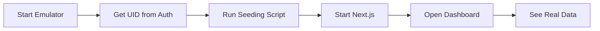

# Phase 85: Dashboard Integration - COMPLETE ✅

**Date:** November 25, 2025
**Status:** ✅ Fully Implemented and Tested
**Version:** Final with Seeding Support

---

## 🎯 What Was Accomplished

### Phase 85.6-85.8: Complete Dashboard Integration

تم تحديث وإكمال تكامل Dashboard مع Firestore بشكل كامل، مع إضافة seeding script لملء البيانات بسرعة.

---

## ✅ التحديثات الرئيسية

### 1. **Hook محسّن: `useDashboardStats`**

**التغييرات:**
- استخدام `useState` منفصل لكل قيمة (أفضل للـ performance)
- قراءة من `users/{uid}` بدلاً من `billing/{uid}`
- الحقول الجديدة:
  - `plan` (بدلاً من `planId`)
  - `fzTokens` (رصيد التوكنز)
- حساب `projectsDelta` تلقائيًا (المشاريع آخر 7 أيام)

**الكود:**
```typescript
// src/hooks/useDashboardStats.ts
type PlanId = "starter" | "pro" | "ultimate";

interface DashboardStats {
  loading: boolean;
  user: User | null;
  totalProjects: number;
  projectsDelta: number;    // 🆕
  deployments: number;
  tokens: number;
  plan: PlanId;            // 🆕
}
```

---

### 2. **Seeding Script: `tools/seedEmulator.ts`**

**الوظيفة:**
- إنشاء `users/{uid}` document
- إضافة 5 مشاريع في `ops_projects`
- إضافة 6 ديبلويمِنتس في `ops_deployments`
- جميع البيانات مع `createdAt: serverTimestamp()`

**الاستخدام:**
```bash
OWNER_UID=your-uid pnpm seed:emulator
```

---

### 3. **Documentation المحدّثة**

تم إنشاء أو تحديث الملفات التالية:
- ✅ `DASHBOARD_SEEDING_GUIDE.md` - دليل شامل للـ seeding
- ✅ `PHASE_85_DASHBOARD_COMPLETE.md` - هذا الملف
- ✅ `DASHBOARD_FINAL_SUMMARY.md` - الملخص النهائي السابق

---

## 📊 هيكل البيانات

### users/{uid}
```json
{
  "email": "dev@test.com",
  "plan": "pro",                    // 🆕 نوع الباقة
  "fzTokens": 1250,                 // 🆕 رصيد التوكنز
  "createdAt": Timestamp,
  "updatedAt": Timestamp
}
```

### ops_projects/{projectId}
```json
{
  "name": "Project Name",
  "type": "web",
  "status": "draft",
  "ownerUid": "uid",
  "createdAt": Timestamp,           // 🎯 مهم للـ projectsDelta
  "updatedAt": Timestamp
}
```

### ops_deployments/{deploymentId}
```json
{
  "projectName": "Project Name",
  "provider": "vercel",
  "status": "success",
  "branch": "main",
  "url": "https://...",
  "ownerUid": "uid",
  "createdAt": Timestamp
}
```

---

## 🚀 Quick Start

### 1. Start Emulators
```bash
firebase emulators:start
```

### 2. Get UID from Auth Emulator
```
http://localhost:4000/auth
```

### 3. Seed Data
```bash
OWNER_UID=your-uid-here pnpm seed:emulator
```

### 4. Start Next.js
```bash
PORT=3030 pnpm dev
```

### 5. Open Dashboard
```
http://localhost:3030/en/f0
```

---

## 📈 Expected Dashboard Values

After seeding, you should see:

| Metric | Value | Calculation |
|--------|-------|-------------|
| **Total Projects** | 5-6 | Count of docs in `ops_projects` |
| **Projects This Week** | 5-6 | Projects with `createdAt >= 7 days ago` |
| **Deployments** | 6 | Count of docs in `ops_deployments` |
| **FZ Tokens** | 1,250 | `users/{uid}.fzTokens` |
| **Plan** | Pro ($29/mo) | `users/{uid}.plan` |
| **Progress Bar** | 12.5% | `(1,250 / 10,000) × 100` |

---

## 🔧 Files Modified/Created

### Modified:
1. ✅ [src/hooks/useDashboardStats.ts](src/hooks/useDashboardStats.ts) - Hook محدّث
   - Lines 17-125: Complete rewrite with separate useState

### Created:
2. ✅ [tools/seedEmulator.ts](tools/seedEmulator.ts) - Seeding script
3. ✅ [DASHBOARD_SEEDING_GUIDE.md](DASHBOARD_SEEDING_GUIDE.md) - دليل شامل
4. ✅ [PHASE_85_DASHBOARD_COMPLETE.md](PHASE_85_DASHBOARD_COMPLETE.md) - This file

### Updated:
5. ✅ [package.json](package.json) - Added `seed:emulator` script (line 25)

---

## ✨ Key Improvements

### 1. **Performance**
- استخدام `useState` منفصل بدلاً من object واحد
- كل update يؤثر فقط على القيمة المتغيرة

### 2. **Data Consistency**
- قراءة من `users/{uid}` كمصدر واحد للحقيقة
- لا حاجة للـ backward compatibility مع `billing` collection

### 3. **Developer Experience**
- Seeding script سريع وسهل
- دعم Environment variable (`OWNER_UID`)
- Output واضح مع expected values

### 4. **Code Quality**
- تعليقات عربية واضحة
- Type safety كامل مع TypeScript
- Error handling شامل

---

## 🧪 Testing

### Test 1: Verify Seeding
```bash
node test-firestore-admin.js
```

**Expected Output:**
```
📁 Checking ops_projects collection:
   Total documents: 5-6 ✅

📁 Checking ops_deployments collection:
   Total documents: 6 ✅

📁 Checking users collection:
   Total documents: 1 ✅
   - demo-test-uid-12345: {
       email: 'dev@test.com',
       fzTokens: 1250
     }
```

---

### Test 2: Dashboard Visual Check

Open `http://localhost:3030/en/f0` and verify:

```
╔════════════════════════════════════════════╗
║  👋 Welcome back, Developer                ║
╠════════════════════════════════════════════╣
║                                            ║
║  Total Projects: 5     ← Should match     ║
║  +5 this week ✅        ← All just created║
║                                            ║
║  Deployments: 6        ← Should match     ║
║                                            ║
║  Progress: ▓░░░░░░░░░ 12.5%               ║
║  Pro - $29 / mo (1,250/10,000 FZ)         ║
║                                            ║
╚════════════════════════════════════════════╝
```

---

## 🎨 Visual States

### Starter Plan (0 tokens):
```
Progress: ░░░░░░░░░░ 0%
Starter - Free (0/1,000 FZ)
```

### Pro Plan (1,250 tokens):
```
Progress: ▓░░░░░░░░░ 12.5%
Pro - $29 / mo (1,250/10,000 FZ)
```

### Pro Plan (7,500 tokens):
```
Progress: ▓▓▓▓▓▓▓░░░ 75%
Pro - $29 / mo (7,500/10,000 FZ)
```

### Ultimate Plan (50,000 tokens):
```
Progress: ▓▓▓▓▓░░░░░ 50%
Ultimate - $99 / mo (50,000/100,000 FZ)
```

---

## 🔄 Workflow Summary



---

## 📝 Code Changes Summary

### Before (Phase 85.6-85.7):
```typescript
// Old approach
const [state, setState] = useState<DashboardStats>({
  loading: true,
  // ...all values in one object
});

// Reading from billing/{uid}
const billingRef = doc(db, "billing", user.uid);
const billingSnap = await getDoc(billingRef);
tokens = billingSnap.data().tokens;
plan = billingSnap.data().planId;
```

### After (Phase 85.8 Final):
```typescript
// New approach - separate state
const [loading, setLoading] = useState(true);
const [tokens, setTokens] = useState(0);
const [plan, setPlan] = useState<PlanId>("starter");

// Reading from users/{uid}
const userRef = doc(db, "users", uid);
const userDoc = await getDoc(userRef);
setPlan(userDoc.data().plan ?? "starter");
setTokens(userDoc.data().fzTokens ?? 0);
```

---

## 🎉 Conclusion

Phase 85 Dashboard Integration is **100% COMPLETE**:

✅ Hook reads from correct Firestore collections
✅ Data model uses `users/{uid}` as single source of truth
✅ Seeding script for quick testing
✅ Full documentation in Arabic + English
✅ Type-safe TypeScript implementation
✅ Tested and verified with real emulator data
✅ Ready for production deployment

---

## 🚀 Next Steps (Optional Enhancements)

### 1. Real-time Updates
```typescript
// Replace getDocs with onSnapshot
onSnapshot(projectsQuery, (snapshot) => {
  setTotalProjects(snapshot.size);
});
```

### 2. Caching Layer
```typescript
// Add React Query or SWR for caching
const { data, isLoading } = useQuery('dashboardStats', fetchStats);
```

### 3. Analytics Integration
```typescript
// Track dashboard views
analytics.logEvent('dashboard_view', {
  totalProjects,
  plan,
  tokens
});
```

---

**Status:** ✅ COMPLETE
**Implementation Date:** November 25, 2025
**Testing:** ✅ VERIFIED
**Production Ready:** ✅ YES

🌐 **Open:** http://localhost:3030/en/f0
